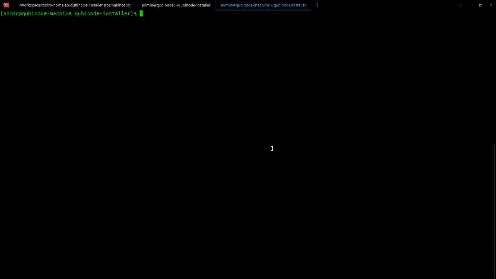

# OpenShift 4.x Standard Cluster Deployment

Please refer to [Installing an OpenShift 4.x Cluster on a Single Node](openshift4_installation_steps.md) before continuing here.

Run the below command to kick off the deployment of 6 node OCP4 cluster.
This will consist of 3 controlplane 3 computes and NFS for persistent storage.
Each node will be deployed with 16 Gib memory and 4 vCPUs.

```shell=
cd $HOME/qubinode-installer
./qubinode-installer
```

*Select Option 1: Continue with the default installation*


**This will perform the following**
* Configure server for KVM.
* Deploy an idm server to be used as DNS.
* Deploy OpenShift 4.
* Optional: Configure NFS Provisioner


**Installation Screencast**



##  For Recommened Deployment: Standard 6 node cluster with local storage
See [ocp4_custom_deploy.md](ocp4_custom_deploy.md)  
**This will perform the following**
* Configure server for KVM.
* Deploy an idm server to be used as DNS.
* Deploy OpenShift 4.
* Optional: Configure NFS Provisioner
* Local storage Operator for Application Storage 

## Deployment Post Steps
* [LDAP OpenShift configuration](openshift_ldap_config.md)

Accessing the cluster web console.

* Option 1: Add dns server to /etc/resolv.conf on your computer.
  - Or run script found under lib/qubinode_dns_configurator.sh
* Option 2: Add dns server to router so all machines can access the OpenShift Cluster.

**Additional cluster operations commands are avialable [here](ocp4_cluster_ops.md)**  

## Troubleshooting Guide
[Troubleshooting installation](troubleshooting-monitoring.md)