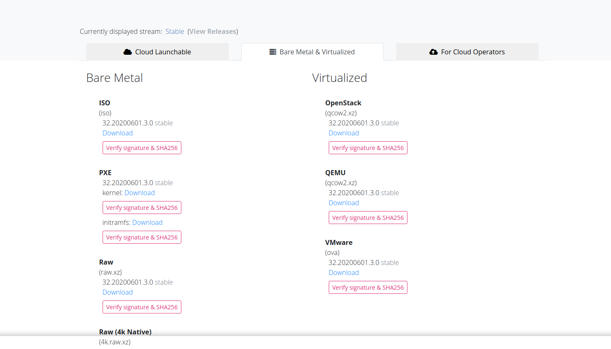

#  Installing OKD - The Community Distribution of Kubernetes 4.x Cluster on a Single Node [Still in Development/Test]

The following documentation will help you deploy an  Community Distribution of Kubernetes  (OKD) 4.x cluster, on a single node.
The installation steps deploys a production like OCP4 cluster, in a environment with 3 controlplanes and 3 computes on a KVM hosts running Red Hat Enterprise Linux (RHEL)


## Prerequisites

Refer to the [Getting Started Guide](../README.md) to ensure RHEL 8 is installed.
You can jump back to this page one you have RHEL install. You don't have to go through
with the rest of the steps on that page.

## Install OKD

### Download the qubinode-installer

Download and extract the qubinode-installer as a non root user.

```shell=
cd $HOME
wget https://github.com/Qubinode/qubinode-installer/archive/main.zip
unzip main.zip
rm main.zip
mv qubinode-installer-main qubinode-installer

```

### Install OKD4

```
cd $HOME/qubinode-installer
./qubinode-installer -p okd4
```

The install will prompt with for input, one of those input is the **Custom Cluster Deployment Options**.
You can just choose option 7 to continue with the default deployment as described in the above diagram.
Or you can choose any of the other options to deploy a different size cluster.

#### Deploy the lastest OKD4
You can deploy the latest release of OKD4 and use the latest Fedora CorOS by following the steps below before running the qubinode-installer.

**Get the lastest OKD4 release name**

Grab the release name from the [okd Github](https://github.com/openshift/okd/releases).

Then follow the steps below.
```
cd $HOME/qubinode-installer
cp samples/okd4.yml playbooks/vars/
```

Edit playbooks/vars/okd4.yml and upate the variable **ocp4_release**.
```
ocp4_release: 4.4.0-0.okd-2020-05-23-055148-beta5
```

**Set newest Fedora CoreOS Qcow image tag**

https://getfedora.org/en/coreos/download?tab=metal_virtualized&stream=stable


Edit playbooks/vars/okd4.yml with the latest tag.

```
major_version: "32.20200601.3.0"  #e.g. 32.20200601.3.0
```

### Post deployment
* [LDAP OpenShift configuration](openshift_ldap_config.md)
* [Qubinode OpenShift Cluster Operations](ocp4_cluster_ops.md)
* [Troubleshooting installation](troubleshooting-monitoring.md)


