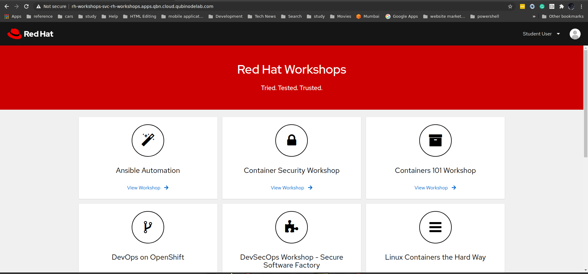

# Red Hat Workshops, but make it spicy

[Red Hat Workshops](https://learn.kemo.network) are a great open source collection of educational materials that cover various topics relating to Red Hat's product portfolio, from Automation with Ansible to Containers and Kubernetes with OpenShift.  There is a set of resources to deploy the workshop environments, currently supported by IBM Cloud.

Github Link: [https://github.com/kenmoini/rh-workshops](https://github.com/kenmoini/rh-workshops)

*Qubinode Support is  in progress and contributions are welcome.*

## Workshop Listing

### Currently Available and Supported Workshops

- Ansible Automation

### Workshops that need maintenance

- Containers 101
- DevOps on OpenShift (Screenshot updates for OCP)
- DevSecOps/SSF
- OpenShift 101 (Screenshot updates for OCP)

### Available but Untested

- Container Security
- Linux Containers the Hard Way
- OpenShift Security Workshop
- OpenShift Service Mesh
- RHEL 8
- SELinux Policies
