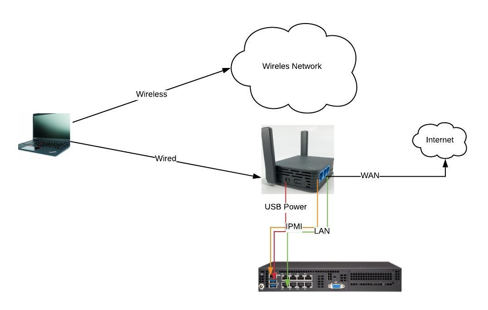

# Supported Hardware specs for Qubinode

Qubinode-installer may support different product types. The table below defines what is need for an OpenShift Deployment.

Below are a set of hardware specs for qubinode-installer to install OpenShift

## Hardware Spec Table
|   | **Minimum** | **Recommended** |
| --- | :--- | :--- |
|  **CPU** | 6 Core | 8 core or more |
|  **Memory** | 64 GB | 128 or more |
|  **Root Disk** | 80 GB SSD | 500 or more |
|  **Secondary Drive** | 500 GB SSD | 1 TB Nvme Drive |

## Recommended Systems

Here are some of the systems we recommend. The router and cables are optional. The router accomplishes two things right now.

1. Allows for keeping the qubinode network separate from yours. You would need to put in a static route from your router to this router if you wanted to get to qubinode from your network.
2. Makes the qubinode portable. You can plug the router into an existing network or bridge an existing wireless network. That existing wired or wireless network is how you will get internet access. Then you will have a segregated wired and wireless network for the qubinode.

### 6 Core Systems (Low)

|  **Componets** | **Description** | **Unit Cost** | **QTY** | **Total** | **Amazon URL** |
| --- | --- | --- | --- | --- | --- |
|  System | SuperServer E200-8D 6 Cores, 12 Threads, 1.9-2.2GHz | $858.95 | 1 | $858.95 | https://amzn.to/2VZMIX4 |
|  Memory | Samsung M393A4K40BB1-CRC 32GB DDR4-2400 LP ECC Reg Server Memory | $101 | 4 | $402 | https://amzn.to/2MZuf8G |
|  SSD | WD Blue 3D NAND 500GB Internal PC SSD - SATA III 6 Gb/s, 2.5"/7mm, Up to 560 MB/s - WDS500G2B0A | $63.99 | 1 | $63.99 | https://amzn.to/2P0JXDh |
|  NVME | Intel Solid State Drive (SSD), 660P Series, 1 TB | $99.99 | 1 | $99.99 | https://amzn.to/2MTnIMW |
|  Router | GL.iNet GL-AR750S-Ext Gigabit Travel AC Router (Slate), 300Mbps(2.4G)+433Mbps(5G) Wi-Fi, 128MB RAM, MicroSD Support, OpenWrt/LEDE pre-Installed, Cloudflare DNS, Power Adapter and Cables Included | $69.99 | 1 | $69.99 | https://amzn.to/33GUuYr |
|  Cable | InstallerParts Ethernet Cable CAT6 Cable UTP Booted 1 FT - Green - Professional Series - 10Gigabit/Sec Network/High Speed Internet Cable, 550MHZ | $5.79 | 2 | $11.58 | https://amzn.to/2VTXEoQ |
|   |  | **Subtotal** |  | $1,506.50 |  |

### 8 Core Systems (Medium)

This system has not been tested, however, we included it here because of the price for a 8 core/16 thread system.

|  **Componets** | **Description** | **Unit Cost** | **QTY** | **Total** | **Amazon URL** |
| --- | --- | --- | --- | --- | --- |
|  System | Supermicro A+ Server E301-9D-8CN4, 8 Core/16 Thread, RCC DDR4 2666MHz SDRAM in 4 DIMMs | $999.95 | 1 | $999.95 | https://amzn.to/31vYbhU |
|  Memory | Samsung M393A4K40BB1-CRC 32GB DDR4-2400 LP ECC Reg Server Memory | $101 | 4 | $402 | https://amzn.to/2MZuf8G |
|  SSD | WD Blue 3D NAND 500GB Internal PC SSD - SATA III 6 Gb/s, 2.5"/7mm, Up to 560 MB/s - WDS500G2B0A | $63.99 | 1 | $63.99 | https://amzn.to/2P0JXDh |
|  NVME | Intel Solid State Drive (SSD), 660P Series, 1 TB | $99.99 | 1 | $99.99 | https://amzn.to/2MTnIMW |
|  Router | GL.iNet GL-AR750S-Ext Gigabit Travel AC Router (Slate), 300Mbps(2.4G)+433Mbps(5G) Wi-Fi, 128MB RAM, MicroSD Support, OpenWrt/LEDE pre-Installed, Cloudflare DNS, Power Adapter and Cables Included | $69.99 | 1 | $69.99 | https://amzn.to/33GUuYr |
|  Cable | InstallerParts Ethernet Cable CAT6 Cable UTP Booted 1 FT - Green - Professional Series - 10Gigabit/Sec Network/High Speed Internet Cable, 550MHZ | $5.79 | 2 | $11.58 | https://amzn.to/2VTXEoQ |
|   |  | **Subtotal** |  | $1,647.50 |  |

### 8 Core Systems (High)

|  **Componets** | **Description** | **Unit Cost** | **QTY** | **Total** | **Amazon URL** |
| --- | --- | --- | --- | --- | --- |
|  System | Supermicro Superserver E300-9D-8CN8TP Intel Xeon D-2146NT Networking PC w/ 2X SFP+, 2X 10GbE LAN, 4X GbE LAN, IPMI, 4xDIMMS, 256GB RDIMM, 512G LRDIMM, 8 cores, 16 threads, CPU TDP 80w | $1,653.25 | 1 | $1,653.25 | https://amzn.to/2px72CS |
|  Memory | Samsung M393A4K40BB1-CRC 32GB DDR4-2400 LP ECC Reg Server Memory | $101 | 4 | $402 | https://amzn.to/2MZuf8G |
|  SSD | Samsung 860 EVO 500GB 2.5 Inch SATA III Internal SSD (MZ-76E500B/AM) | $74.99 | 1 | $74.99 | https://amzn.to/31vSLU6 |
|  NVME | Samsung 970 PRO Series - 1TB PCIe NVMe - M.2 Internal SSD Black/Red (MZ-V7P1T0BW) | $338.48 | 1 | $338.48 | https://amzn.to/31vk4OC |
|  Router | GL.iNet GL-AR750S-Ext Gigabit Travel AC Router (Slate), 300Mbps(2.4G)+433Mbps(5G) Wi-Fi, 128MB RAM, MicroSD Support, OpenWrt/LEDE pre-Installed, Cloudflare DNS, Power Adapter and Cables Included | $69.99 | 1 | $69.99 | https://amzn.to/33GUuYr |
|  Cable | InstallerParts Ethernet Cable CAT6 Cable UTP Booted 1 FT - Green - Professional Series - 10Gigabit/Sec Network/High Speed Internet Cable, 550MHZ | $5.79 | 2 | $11.58 | https://amzn.to/2VTXEoQ |
|   |  | **Subtotal** |  | $2,550.29 |  |

### DIY 32 Core System with 256G Ram

|  **Componets** | **Description** | **Unit Cost** | **QTY** | **Total** | **Buy URL** | **Notes** |
| --- | --- | :--- | :--- | :--- | :--- | :--- |
|  Motherboard | ASRock Motherboard ATX DDR3 1066 Intel LGA 2011 EP2C602-4L/D16 | $349.99 | 1 | $349.99 | https://bit.ly/2W05Xzx | Any LGA 2011 Socket motherboard can be used here |
|  CPU | Intel Matching Pair Xeon E5-2670 Eight Cores Processors 2.60GHz 20MB Smart Cache 8.00 GT/S QPI TDP 115W SR0KX BX80621E52670 | $132.99 | 1 | $132.99 | https://amzn.to/2P0N91G | Most E5-26xx should work with above motherboard |
|  Memory | Timetec 128GB Kit (8x16GB) DDR3L 1600MHz PC3-12800 Registered ECC 1.35V CL11 2Rx4 Dual Rank 240 Pin RDIMM Server Memory RAM Module Upgrade (128GB Kit (8x16GB)) | $312.99 | 2 | $625.98 | https://amzn.to/2VUqcPj | Cheapest available |
|  CPU FAN | Noctua NH-D14, Premium CPU Cooler with Dual NF-P14 PWM and NF-P12 PWM Fans (Brown) | $79.95 | 2 | $159.90 | https://amzn.to/31q9Ij3 | Fan need to be compatible with LGA2011-3 Square ILM |
|  Case | Rosewill 4U Server Chassis/Server Case/Rackmount Case, Metal Rack Mount Computer Case with 8 Bays & 4 Fans Pre-Installed (RSV-R4000) | 104.99 | 1 | 104.99 | https://amzn.to/2P84R3z | Not sure if the motherboard would fit in standard ATX case. |
|  Power Supply | CORSAIR RMX Series, RM850x, 850 Watt, 80+ Gold Certified, Fully Modular Power Supply | $129.97 | 1 | $129.97 |  |  |
|  NVME | Intel Solid State Drive (SSD), 660P Series, 1 TB | $99.99 | 1 | $99.99 | https://amzn.to/2MTnIMW |  |
|  PCI to NVME Adapter | M.2 NVMe SSD NGFF to PCIE 3.0 X16 /X4 Adapter M Key Interface Card Support PCI Express 3.0 x4 2230-2280 Size m.2 Full Speed (Black Gold | $13.99 | 1 | $13.99 | https://amzn.to/33HbZYD |  |
|  SSD | WD Blue 3D NAND 500GB Internal PC SSD - SATA III 6 Gb/s, 2.5"/7mm, Up to 560 MB/s - WDS500G2B0A | $63.99 | 1 | $63.99 | https://amzn.to/2P0JXDh |  |
|   |  | **Subtotal** |  | $1,681.79 |  |  |